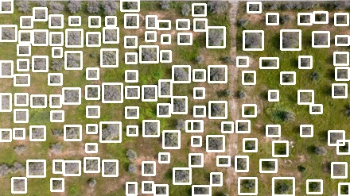

# Olive-Tree-Detector
 in progress ...
 The detection functionality is already implemented, and a web application interface is in development to make the tool easily accessible through a browser.

## Example Detection

Here is a sample of the olive tree detection output:

